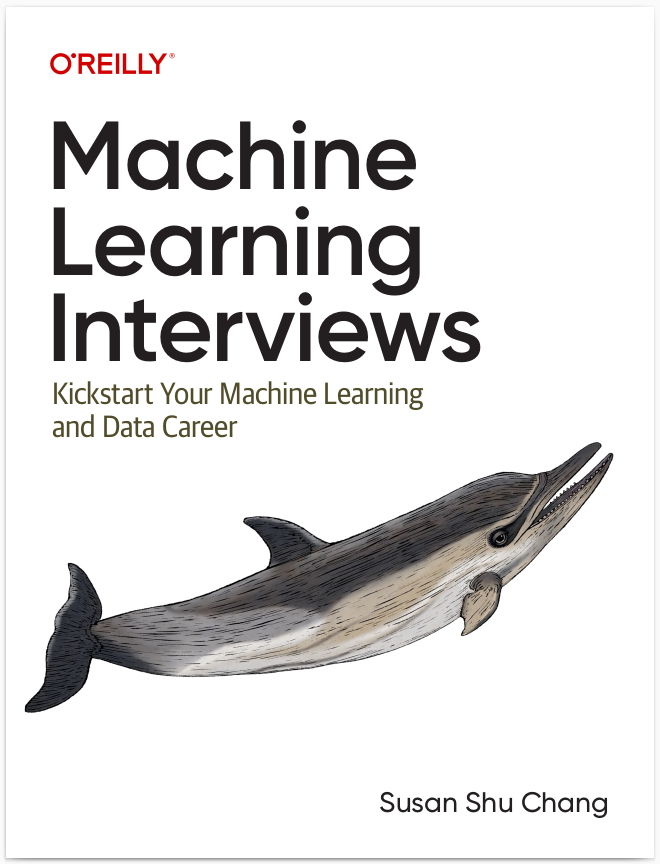

# Interview preparation bot for data scientists

Are you a data scientist willing to land your first data scientist job? 

Are you data science professional seeking for a more senior role that needs a roadmap to organize and structure the different aspects you have to work on when preparing your future interviews? 

## Then continue reading because you can be very interested in what this project can offer you... 

This project has a chatbot based on a book aimed at aspiring professionals in machine learning (ML), data science, and related fields in artificial intelligence (AI). 





It is valuable for those just starting out as well as more experienced professionals, including entry-level, senior-level, and technical leadership roles like staff+ or principal.

The book is intended to help individuals who face challenges in the job search process within the ML field, offering guidance on how to navigate interviews, stand out as a candidate, and meet the often unspoken expectations of companies. Although traditional advice often suggests having advanced degrees like a PhD or at least a master’s degree, the author provides a more flexible approach for those looking to succeed without strictly following that path.

## This chatbot can help you if:

• You are a recent graduate who is eager to become an ML/AI practitioner in
industry.
• You are a software engineer, data analyst, or other tech/data professional who is
transitioning into a role that focuses on ML day to day.
• You are a professional with experience in another field who is interested in tran‐
sitioning into the ML field.
• You are an experienced data scientist or ML practitioner who is returning to the
interviewing fray and aiming for a different role or an increased title and respon‐
sibility, and you would like a comprehensive refresher of ML material.


## This chatbot cannot help you if:

• You are looking for statistics or ML concepts.
• You need to improve your coding skills.
• You want to learn a new ML or technology.
• You are expecting to find a question bank. Code snippets will be brief and concise since they become outdated quickly.


Key Components

## Dataset


## Tehnologies

* minsearch
* Llama2
* Flask as the API interface


## Running it

We use pipenv for managing dependencies and Python 3.10.12

Make sure you have pipenv installed:

```bash
pip install pipenv
```


## Running it with Docker

```bash
docker-compose up
```
To test or change something in the Dockerfile, use the following command:

```bash
docker build -t chatbot .

docker run -it --rm  \
    -e DATA_PATH="data/data.csv" \
    -p 5000:5000  \
       chatbot
    
```

## Preparing the application

Before using the app we need to initialize the database

We can do it by running the [db_prep.py](chatbot/db_prep.py) script:

```bash
pipenv shell
cd chatbot
export POSTGRES_HOST=localhost 
python db_prep.py
```

## Running locally
### Installing the dependencies

In case you want to run it locally, you need to manally prepare the environment and install all the dependencies

```bash
pipenv install --dev
```
### Running the flask Application

Run the following command for running the application locally:

```bash
pipenv shell 
export POSTGRES_HOST=localhost 
python app.py

```

## Prerequisites

- Ensure you have [Ollama](https://ollama.com) installed on your system.

### Llama2 setup

1. Start the Ollama server:

```bash
ollama serve
```

2. Pull the Llama2 model:

```bash
ollama pull llama2
```

## Using the application

### Testing the flask application:

```bash
URL="http://127.0.0.1:5000"
DATA='{"question": "what is the scope of a data scientist?"}'

curl -X POST \
    -H "Content-Type: application/json" \
    -d "${DATA}" \
    "${URL}/ask"
```


### The answer will look similar to this:

```json
"conversation_id": "4b31952c-6c04-41ec-971d-649cc2c85807",
  "question": "what is the scope of a data scientist?",
  "result": "A data scientist's scope typically involves working on various aspects of the machine learning (ML) lifecycle, including data preparation, model development, deployment, and maintenance. The specific responsibilities may vary depending on the company, team, and job title, but some common tasks include:\n\n1. Data analysis: Cleaning, processing, and interpreting large datasets to extract insights and identify patterns.\n2. Model development: Building, training, and validating ML models using various techniques, such as supervised and unsupervised learning, deep learning, and reinforcement learning.\n3. Deployment: Integrating trained models into production environments, ensuring they are scalable and reliable.\n4. Maintenance: Monitoring model performance, updating or refreshing models as needed, and addressing any issues that arise.\n5. Collaboration: Working closely with cross-functional teams, such as engineering, product management, and business stakeholders, to identify ML opportunities and solve complex problems.\n6. Communication: Presenting findings and insights to stakeholders, communicating results effectively, and explaining technical concepts to non-technical audiences.\n7. Data visualization: Creating informative and engaging visualizations to help communicate insights and findings to stakeholders.\n8. Algorithm selection: Choosing the most appropriate algorithms and techniques for a given problem or dataset, based on factors such as data quality, complexity, and scalability.\n9. Hyperparameter tuning: Optimizing model performance by adjusting hyperparameters, which are parameters that control the behavior of ML models.\n10. Model evaluation: Assessing the performance of ML models using various metrics and techniques, such as cross-validation, to ensure they are accurate and robust.\n\nOverall, a data scientist's scope involves working on a wide range of tasks related to data analysis, model development, deployment, and maintenance, with a focus on leveraging ML techniques to drive business impact."

```

Sending feedback:
```bash
ID="17c9be3e-ac88-4de7-b53d-1942a2ffe6dc"

URL=http://localhost:5000
FEEDBACK_DATA='{
    "conversation_id": "'${ID}'",
    "feedback": 1
}'

curl -X POST \
    -H "Content-Type: application/json" \
    -d "${FEEDBACK_DATA}" \
    ${URL}/feedback

 ```   


Alternatively you can use [test.py](test.py) for testing purposes:

```bash
pipenv run python test.py

```


## Requirements

To run this project locally, ensure you have the following:

    Python 3.10
    Pipenv shell to activate the virtual environment

    Ollama installed in the environment
    Elasticsearch for search and retrieval functionalities


## Ingestion

The code for ingesting the data can be checked the [ingestion script](notebooks/ingestion.py)

## Evaluation

The code for evaluating the system can be checked the [rag_llama2 script](notebooks/rag_llama2.py)


## Retrieval 

Approach using minsearch without any boosting gave the following metrics:

*'hit_rate': 0.77
*'mrr': 0.62

The optimized minsearch function gave the following metrics:

*'hit_rate': 0.83
*'mrr': 0.67

The best boosting parameter:

```
'boost': 0.21
```

## Rag Flow

LLM-as-a-judge as been used as metric to evaluate the quality of the RAG Flow 

Among 229 records:

* X RELEVANT : 213 (93%)
* Y PARTLY RELEVANT : 16 (6%)
* Z IRRELEVANT : 0

## Setting up Grafana

You can find in the Grafana folder:

    init.py -  initializing Grafana
    dashboard.json - the actual dashboard 

To initialize the dashboard, first ensure Grafana is running (it starts automatically when you do docker-compose up).

Then run:
```bash
pipenv shell

cd grafana

env | grep POSTGRES_HOST

python init.py
```
localhost:3000:

    Login: "admin"
    Password: "admin"


```