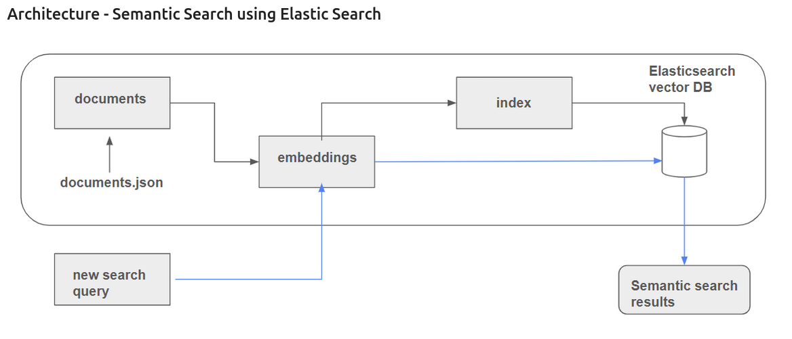

 # Experimentation with different retrieval methods

 This folder contains notebooks where you can find the analysis of different retrieval methods applied to the project but before that let's briefly explain some concepts.

 ## What is a retrieval?

 Retrieval, or information retrieval, is the process of searching for and retrieving relevant data from a large set of information. In the context of data science it usually refers to finding specific documents, passages, or data points that answer a given query.

 ## How Does Retrieval Work?

The basic retrieval process involves:

1. User Query: A user poses a question or search expression.
2. Index: The retrieval system has previously indexed a set of documents or data, allowing for fast searching.
3. Search and Matching: The system compares the query to the index and finds the most relevant documents based on certain criteria.
4. Ranking: Retrieved documents are ranked by relevance using a specific metric or algorithm.
5. Results: The most relevant documents or pieces of information are presented to the user.

## Common Retrieval Methods

Retrieval methods can be categorized based on the type of search, model, or technique used. Here are the most common ones:

1. Keyword-based Retrieval: Simple, traditional keyword matching.
2. Vector Space Model (VSM): Uses vector similarity (e.g., cosine similarity) for ranking.
3. BM25: An advanced term-based ranking model often used in modern search engines.
4. Dense Retrieval: Embedding-based retrieval that uses vector similarity in high-dimensional space.
5. K-Nearest Neighbors (KNN): Finds k most similar documents based on vector distance.
6. Neural Retrieval: Deep learning models that learn to rank documents based on context and semantics.

## Which engines you are going to find in this project?

The engines used in the experimentation are:

1. minsearch

2. Elasticsearch

### Minsearch engine approach

### Elasticsearch engine approach

The used methods are:

1. Full-text Search: find sections or chapters that specifically talk about the interview process inside of a single field.

2. Multi-field Search: since the book is structured in different chapters with titles, 
sections and text to find results in multiple fields at the same time.

3. Filtering: the book has two types of relevant chapters depending on the type of interview (technical or behavioral)

4. Semantic Search: the book can be converted to semantic embeddings to use KNN so the words don't have to perfectly match. 

Elasticsearch uses BM25 by default to sort the results by relevance.

## Which Retrieval Methods you are going to find in this project?

Vector Search: Uses dense_vector fields and the KNN (k-nearest neighbor) query.
Semantic Search: Use precomputed embeddings and perform a similarity search on those vectors.
Hybrid Search: Combine a traditional search (e.g., match query) with a KNN query in a bool query structure, similar to:

## Elasticsearch Methods
BM25 (Best Matching 25)
Fuzzy Search
Dense Vector Search

Here is an example of architecture for semantic search:

 

     
 

 ## Why using retrieval?

 Whether or not retrieval is necessary depends on the type of application or task you're working on. Retrieval becomes essential when you need to access relevant information from a large collection of data, particularly when you’re dealing with:

 1. Large Data Sets
 2. Question answering systems
 3. Recommendation systems
 4. Information retrieval tasks in NLP

 ## Metrics used

 explain types of metrics and matrices